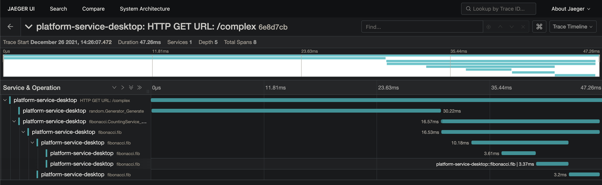

# Observability

## Tracing

* Всегда передавайте первым аргументом `context.Context`. Особенно это важно для
  функций и методов:
    * в которых происходит сетевое взаимодействие.
    * в которых идёт долгий и сложный процесс вычислений.
* При входе в функцию стартуйте **новый** спан.
* Перепишите контекст, вернувшийся из функции старта спана. Это важно для
  сохранения порядка и вложенности спанов.
  ```go
  span, ctx := tracing.SpanStartFromContext(ctx)
  ```
* Идеальный трейс должен выглядеть как на изображении ниже.
    * Все спаны вложены в корневой спан.
    * По трейсу легко отследить ход выполнения программы.
    * Легко видеть, какая операция сколько времени заняла в разрезе всего
      трейса.
      

## Metrics

...

## Logging

...
